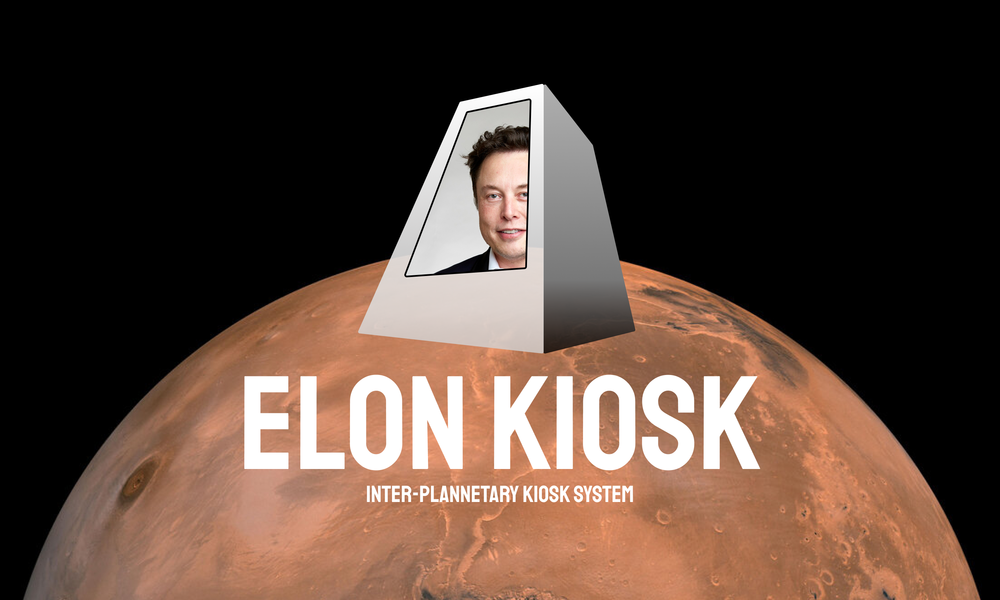
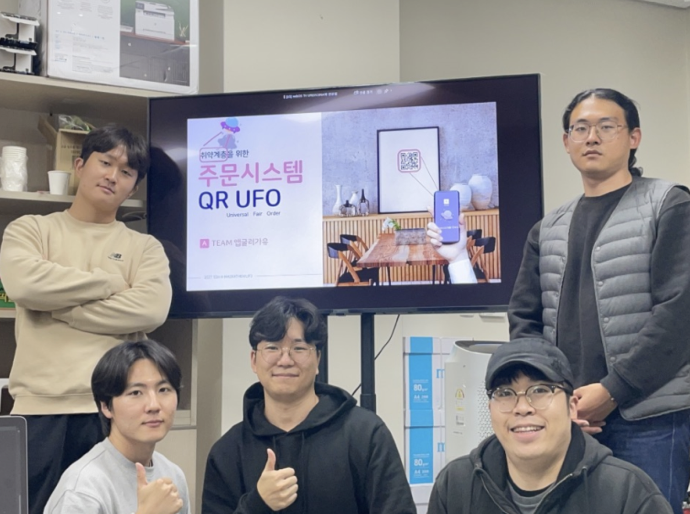

# Elon Kiosk : The INTER-PLANNETARY Kiosk System

The Elon Kiosk (or QR UFO - Universal Fair Order) is a QR order service that is convenient for all users, including the elderly, children, wheelchair users, people with disabilities, pregnant women, and other socially vulnerable groups. These are the core functionalities included:

1. To overcome the disadvantages of kiosks that are difficult to use and vary from store to store, users can use their own smartphones, which are the most familiar devices to them, to order on a consistent UI.
2. Users can order by scanning a QR code from their own seat without having to stand in line to order.
3. The service is divided into regular mode and easy mode, and if accessed in easy mode, it provides large letters and an intuitive UI, making it easier for middle-aged and elderly customers to use.

This project was developed as part of the [K-Hackaton 2022](http://www.k-hackathon.com) hosted by [MSIT (Ministry of Science and ICT)](https://www.msit.go.kr).

## Project Results

- [Final presentation PPT](./docs/pdfs/presentation.pdf)

## Team members

|  |
|---|

From left to right:

- [Seongmin Bae](https://github.com/chopinballadeno4): Frontend Developer
- [Dukho Choi](https://github.com/JASON-DH): Product Owner / Marketing Manager
- [Yesung Lee](https://github.com/Isaac-Lee): Backend Developer
- [Sunghan Kim](https://github.com/s-ggul): Frontend Developer
- [Haeram Kim](https://github.com/haeramkeem): Project Manager / DevOps Engineer
